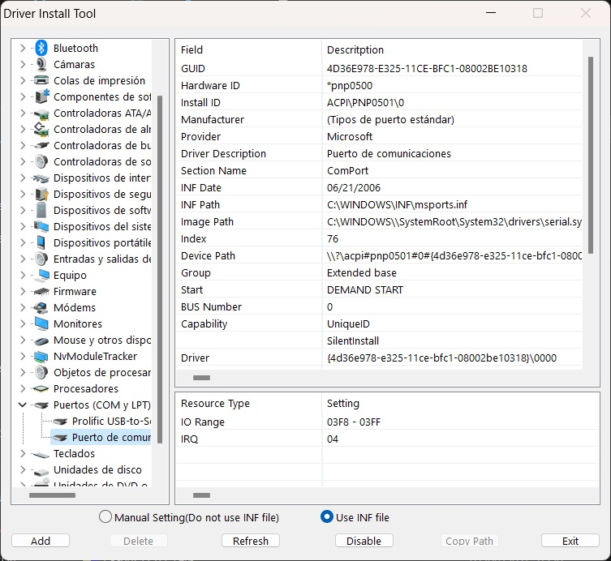
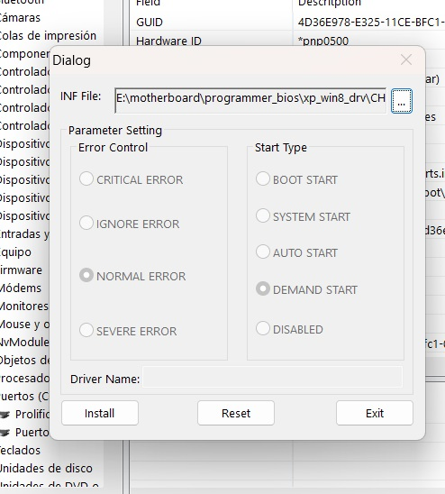

# Device Driver Installation Manager

View, manage your current device in a list and add *.INF drivers for them. Supports from Windows XP to Windows 11 on all processor platforms. (x86/x86_64/arm/arm64/ia64)

